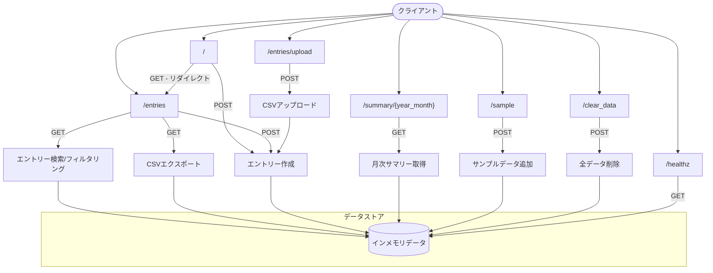
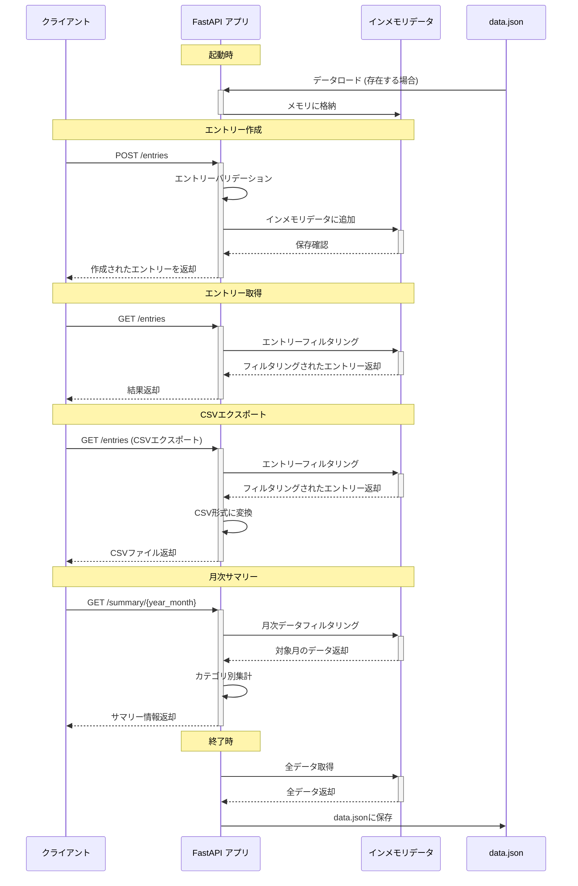
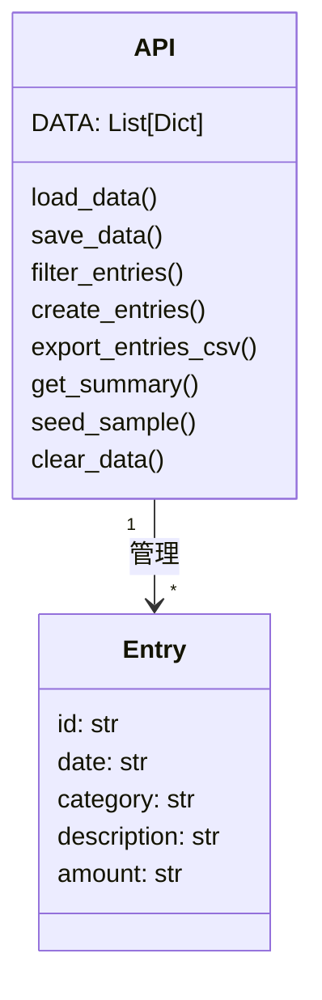
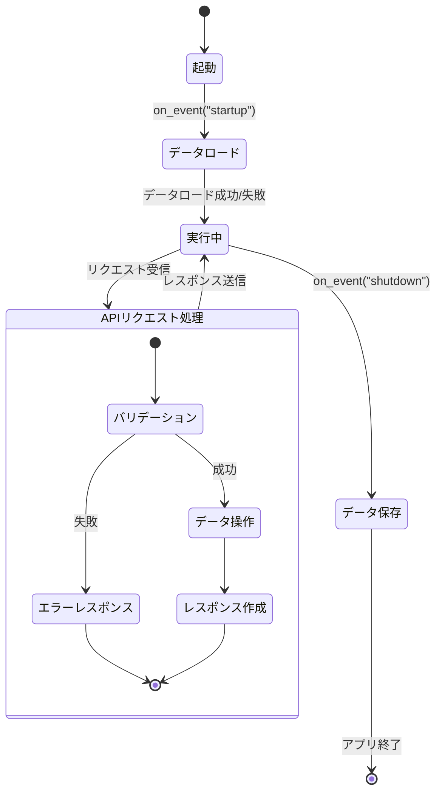
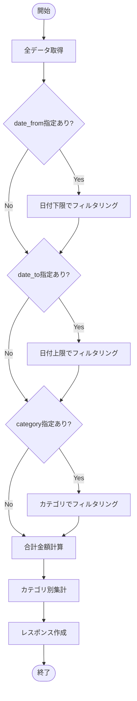
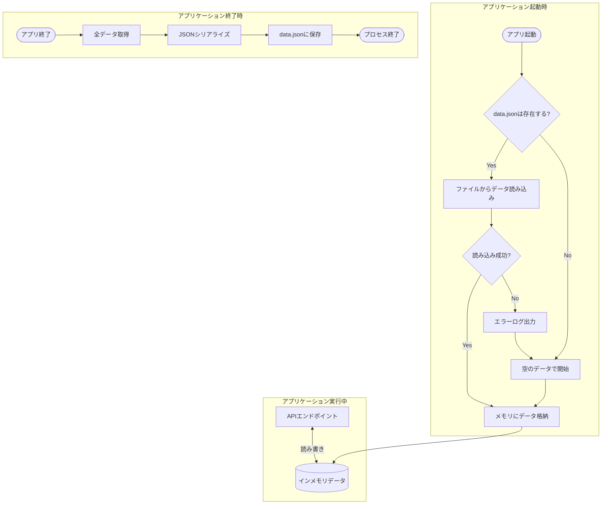

# 家計簿API（Chaos Kakeibo API）の構造図

このドキュメントでは、`main.py`に実装された家計簿APIの構造をMermaid記法を用いて視覚化しています。

## 1. エンドポイント構造図

この図はAPIのエンドポイント構造を表しています。各エンドポイントの関係性とHTTPメソッドを確認できます。

## 2. リクエスト/レスポンスフロー図

この図は主要なエンドポイントにおけるリクエスト/レスポンスの流れを表しています。

## 3. データモデル図

この図はAPIで扱われるデータモデルを表しています。

## 4. アプリケーションライフサイクル図

この図はアプリケーションのライフサイクルを表しています。

## 5. エントリーのフィルタリングフロー図

この図は`/entries`エンドポイントでのフィルタリング処理を表しています。

## 6. データ永続化図

この図はアプリケーションのデータ永続化のフローを表しています。

これらの図を通じて、家計簿APIの構造と動作を様々な角度から視覚的に理解することができます。
